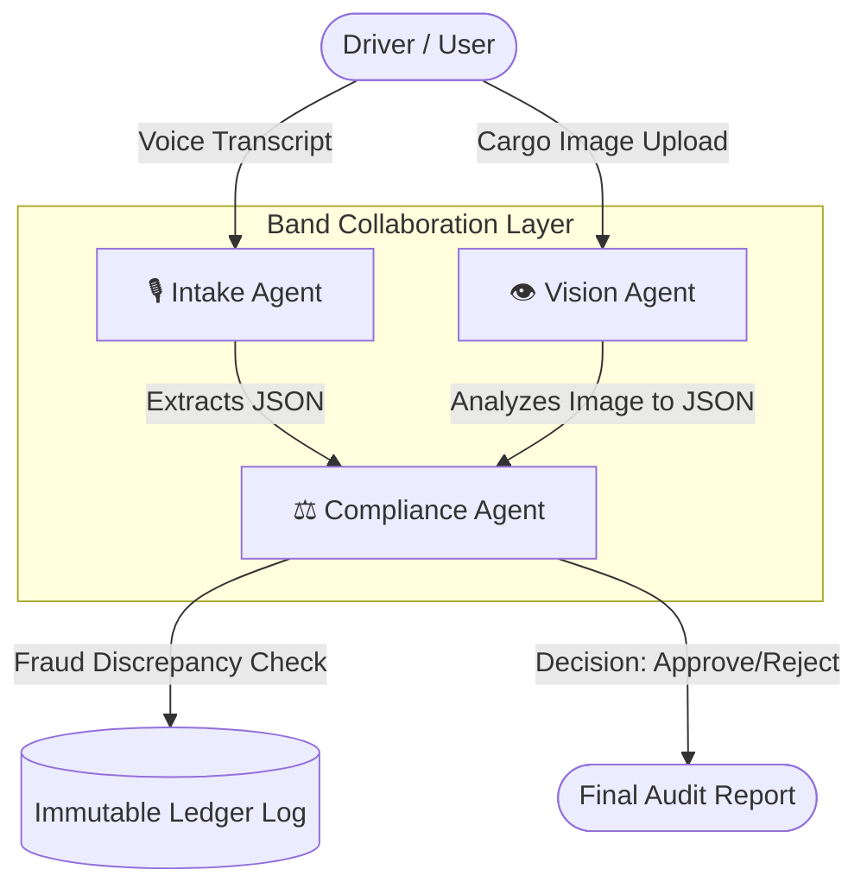

# 📦 SafeHands AI: Compliance Orchestrator

[](https://safe-hands-ai-five.vercel.app)
[](https://vercel.com/new/clone?repository-url=https://github.com/swatiicfai/SafeHands-AI)

SafeHands AI is a distributed, multi-agent AI pipeline designed to automate logistics and insurance claims. By separating cognitive tasks across specialized agents connected via the **Band** coordination layer, SafeHands AI detects insurance fraud in real-time by cross-checking driver claims against multi-modal computer vision analysis.

---

## 🏆 Hackathon Judging Criteria Met

We built this project specifically for the **Band of Agents Hackathon (Track 3: Regulated & High-Stakes Workflows)**. Here is exactly how we meet every judging criterion:

### 1. Application of Technology (Band Coordination)
We built **3 entirely independent, specialized Remote Agents** (Intake, Vision, and Compliance) that run in separate processes. They authenticate with the Band platform, listen for events, and use Band's WebSocket routing (`tools.send_message` with `@handles`) to hand off data and context. **Band is the absolute backbone of our workflow**, not just a wrapper.

### 2. Business Value (Solving Real Enterprise Problems)
Logistics and freight insurance fraud costs enterprises billions annually. A human adjuster has to manually read a driver's transcript ("the cargo was completely destroyed") and cross-reference it against photographic evidence. **SafeHands AI completely automates this.** It instantly catches discrepancies (e.g., driver claims 100% damage, but AI vision proves it's only 30%) and prevents fraudulent payouts automatically.

### 3. Originality (Multi-Modal Collaboration)
Our project is the exact opposite of a basic chatbot. We ingeniously divided the cognitive load: one agent specializes in parsing messy human text/voice (Featherless), another acts as the "eyes" using advanced Vision AI (Featherless Qwen-VL), and a third agent acts as the "brain" (AI/ML API Llama 3.3 70B) to review their outputs, detect lies, and make a high-stakes financial decision. 

### 4. Presentation
We built a stunning, premium Glassmorphism web dashboard. It clearly visualizes the inputs (Transcript + Image) and generates a final **Agent Audit Report**. When the system runs, the user can visually see the AI's rationale and the immutable Ledger execution log, making the complex multi-agent backend incredibly easy to understand.

---

## 🧠 Multi-Agent Architecture



### The 3 Agents
1. **Intake Agent (Featherless API / Llama 3.1 8B):** Parses unstructured driver transcripts into structured JSON data (claimed damage, cargo type).
2. **Vision Agent (Featherless API / Qwen2.5-VL 72B):** A powerful multi-modal model that analyzes the cargo image, detects the cargo type, and estimates the *actual* damage percentage.
3. **Compliance Agent (AI/ML API / Llama 3.3 70B):** The central decision-maker. It cross-references the Intake and Vision reports to catch liars. If the driver claims 100% damage but the Vision agent sees 30% damage, the Compliance agent instantly flags the discrepancy and REJECTS the claim.

---

## 📸 Real-World Demos

### Scenario 1: Fraud Detected & Claim Rejected
The driver claimed the tomatoes were "completely destroyed" (100% loss). However, our Vision Agent detected only 30% damage. The Compliance Agent caught the lie and **REJECTED** the claim, generating a secure ledger block.

*(Upload and drag-and-drop your screenshot of the REJECTED claim here)*

### Scenario 2: Truthful Claim Approved
The driver stated "tomatoes are rotten." The Vision agent confirmed the rot. Because the visual evidence perfectly matched the driver's transcript, the claim was **APPROVED**.

*(Upload and drag-and-drop your screenshot of the APPROVED claim here)*

---

## 🛠️ Tech Stack & Partner APIs

* **Orchestration:** [Band SDK](https://band.ai/) (WebSocket remote agent coordination)
* **Backend:** FastAPI (Python)
* **LLM APIs (Partner Track):**
  * [Featherless.ai](https://featherless.ai/) (Hosting Llama 3.1 8B & Qwen2.5-VL 72B)
  * [AI/ML API](https://aimlapi.com/) (Hosting Llama 3.3 70B)
* **Frontend:** Vanilla JS / CSS with Glassmorphism UI
* **Deployment:** Vercel Serverless

---

## ⚙️ Running Locally

1. Clone the repository
2. Install dependencies: `pip install -r requirements.txt`
3. Add your API keys to a `.env` file:
```env
FEATHERLESS_API_KEY=your_key
AIML_API_KEY=your_key
INTAKE_AGENT_ID=your_id
INTAKE_AGENT_API_KEY=your_key
VISION_AGENT_ID=your_id
VISION_AGENT_API_KEY=your_key
COMPLIANCE_AGENT_ID=your_id
COMPLIANCE_AGENT_API_KEY=your_key
```
4. Start the 3 Band Agents in background processes:
```bash
python band_intake_agent.py
python band_vision_agent.py
python band_compliance_agent.py
```
5. Start the web dashboard:
```bash
python -m uvicorn main:app --reload
```
